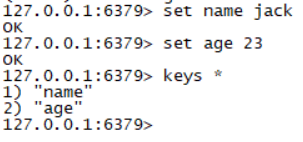
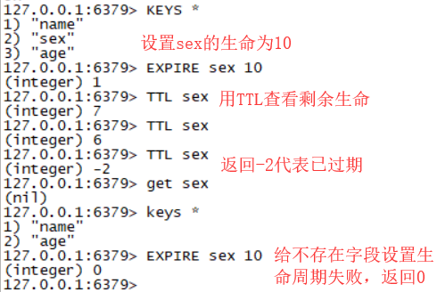
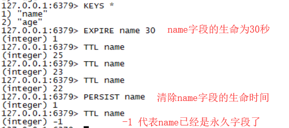
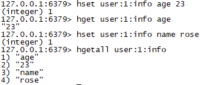
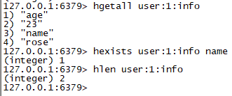

# Redis指令

通过`help`命令可以让我们查看Reddis的指令帮助信息：

在`help`后面跟上`空格`，然后`tab`键，会看到Redis对命令分组的组名:


主要包含：

- @generic: 通用指令
- @string: 字符串类型指令
- @list: 队列结构指令
- @set: set结构指令
- @sorted_set: 可排序的set结构
- @hash: hash结构指令

其中除了@generic以为的，对应了Redis中常用的5中数据类型:

- String: 等同于java中的 `Map<String,String>`
- list: 等同于java中的 `Map<String,List<String>>`
- set: 等同于java中的 `Map<String,Set<String>>`
- sort_set: 可排序的set
- hash: 等同于java中的 `Map<String,Map<String,String>>`
- 可见，Redis中存储数据机构都是类似java的map类型。Redis不同数据类型，只是`map`值的类型不同

## 通用指令

### keys

获取符合规则的键名列表。

- 语法：keys pattern

  示例：keys * （查询所有的键）

  

这里的pattern其实是正则表达式，所以语法基本是类似的

**生产环境一定要禁用keys**(redis是单线程，如果keys* 数据太多，大家都等着吧) 

禁用命令

```
rename-command KEYS     "" 
```

重命名命令

```
rename-command KEYS     "XXXXXXXXXXXXXXXXXXXXXXXXXXXXXXX"
```

------

### exists

判断一个键是否存在，如果存在返回整数1	，否则 返回0


### del

DEL: 删除key，可以删除一个或多个key，返回删除的key的数量

- 语法：DEL key[key ... ]

- 示例：

  

  

### expire

- 语法：

  ```
  EXPIRE key seconds
  ```

- 作用：设置key的过期时间，超过时间后，将会自动删除该key.

- 返回值：

  - 如果成功设置过期时间，返回1。
  - 如果key不存在或者不能设置过期时间，返回0。

### select 

redis默认有16个库，select 0切换到1号数据库，搭建集群的时候会禁用其他的库，在redis.conf中databases修改


### TTL

TTL: 查看一个key的过期时间

- 语法: TTL key

- 返回值：

  - 返回剩余的过期时间

  - -1：永不过期（不设置expire默认）

  - -2：已过期

  - 示例 ：

    

### persist

- 语法：

  ```
  persist key
  ```

- 作用

  移除给定key的生存时间，将这个key从带生存时间key转换成一个不带生存时间，永不过期的key

- 返回值：

  - 当生存时间移除成功时，返回1.
  - 如果key不存在或key没有设置生存时间，返回0

- 示例：



## 字符串指令

字符串机构，其实是Redis中最基础的K-V结构。其建和值都是字符串（其实就是存进去字节）。类似java的Map<String,String>

字符串类型是Redis中最基本的数据类型，它能存储任何形式的字符串，包括二进制数据。可以存储JSON化的对象、字节数组等。一个字符串类型键允许存储的数据最大容量是512MB.

常用命令：

| 语法                     | 说明                                                         |
| ------------------------ | ------------------------------------------------------------ |
| SET key value            | 设置指定key的值                                              |
| GET key                  | 获取指定key的值                                              |
| GETRANGE key  start end  | 返回key中字符串值的子字符                                    |
| INCR key                 | 将key中储存的数字值增一                                      |
| IINCRBY key increment    | 将key所储存的值加上给定的增量值（increment）                 |
| DECR key                 | 将key中储存的值减一                                          |
| DECRBY key decrement     | key所储存的值减去给定的减量值（decrement）                   |
| APPEND key value         | 如果key已经存在并且是一个字符串，APPEND命令将value追加到key原来的值末尾 |
| STRLEN key               | 返回key所储存的字符串值长度                                  |
| MGET key1 key2 ...       | 获取所有（一个或多个）给定的key的值                          |
| MSET key value key value | 同时设置一个或多个key-value对                                |

### incr decr incrby decrby

> incr key 

key自增1，如果key不存在，自增后get(key)=1，也就是从0开始

> decr key

key自减1，如果key不存在，自减后get(key)=-1，也就是从0开始

incrby key k

key自增k，如果key 不存在，自增后get(key)=k

decrby key k

key自减k，如果key不存在，自减后get(key)=-k

### set setnx setxx

不管key是否存在，都设置

> set key value

key不存在，才设置

> setnx key value

key存在，才设置

> set key value xx

示例：


### mget mset 

n次get=n次网络时间+n次命令时间

1次mget=1次网络时间+n次命令时间

> mget key1 key2 key 3

批量获取key，原子操作

> mset key 

批量设置key-value

### getset、append、strlen

set key newvalue 并返回旧的value

> getset key newvalue

将value追加到旧的value

> append key value

返回字符串的长度（注意中文）

> strlen key

### incrbyfloat getrange setrange 

增加key对应的值3.5（浮点数）

> incrbyfloat key 3.5

获取字符串指定下标所有的值

> getrange key start end

设置指定下标所有对应的值

> setrange key index value

### 字符串总结

| 命令          | 含义                         | 复杂度 |
| ------------- | ---------------------------- | ------ |
| set key value | 设置key-value                | o(1)   |
| get key       | 获取key-value                | o(1)   |
| del key       | 删除key-value                | o(1)   |
| setnx setxx   | 根据key是否存在设置key-value | o(1)   |
| incr decr     | 计数                         | o(1)   |
| mget mset     | 批量操作key-value            | o(1)   |


## hash结构命令

Redis的Hash结构类似于Java中的Map<String,Map<String,String>>，键是字符串，值是另一个映射。结构如图:


这里我们称键为key，字段名为hKey，字段值为hValue

常用指令：

> HSET、HSETNX和HGET（添加、获取）

### HSET

- 介绍：

  - `HSET key field value`  将哈希表key中的字段field的值设为value
  - Redis Hset命令用于为哈希表中的字段赋值
  - 如果哈希表不存在，一个新的哈希表被创建并进行HSET操作
  - 如果字段已经存在于哈希表中，旧值将被覆盖

- 返回值：

  - 如果字段是哈希表中的一个新建字段，并且设置成功，返回1
  - 如果字段已经存在于哈希表中且旧值已被新值覆盖，返回0

- 示例：

  

### HGET

- 介绍：`HGET key field` 获取存储在哈希表中指定字段的值
- 返回值：返回给定字段的值，如果给定的字段或key不存在时，返回nil
- 示例：


### HDEL（删除）

HDEL命令用于删除哈希表key中的一个或多个指定字段，不存在的字段将被忽略

- 介绍：HDEL key field2 [field2 ...] 删除一个或多个哈希表字段

- 返回值：

  被成功删除字段的数量，不包括被忽略的的字段

- 示例

### HGETALL（获取所有）

- 介绍：`HGETALL key` 获取在哈希表中指定key的所有字段和值（它的key和value都返回）

- 返回值：

  指定key的所有字段的名及值。返回值里，紧跟每个字段名（field name）之后是字段的值（value），所以返回值的长度是哈希表大小的两倍

- 示例：

  

### HEXISTS、HLEN

判断hash key是否有field

> hexists key field

获取hash key field的数量

> hlen key

示例：



### HMGET、HMSET

批量获取hash key的一批field对应的值

> hmget key field1 field2... fieldN

批量设置hash key的一批field value

> hmset key field value1 field2 value2 ....

### HKEYS

- 介绍：HKEYS key 获取所有哈希表中的字段

- 示例

  

### HVALS

- 介绍：`KVALS key` 获取哈希表中所有的值

- 注意：这个命令不是HVALUES，而是HVALS，是value的缩写：val

- 示例：

  
